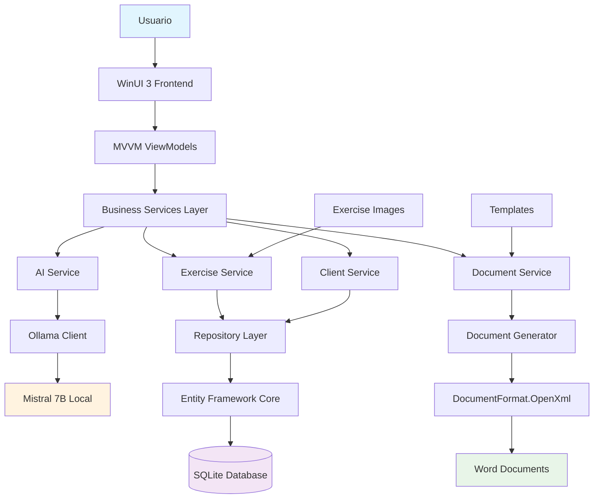
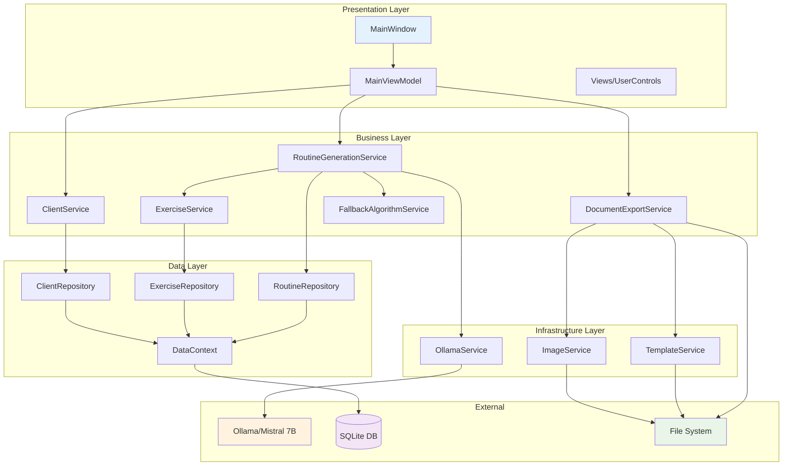
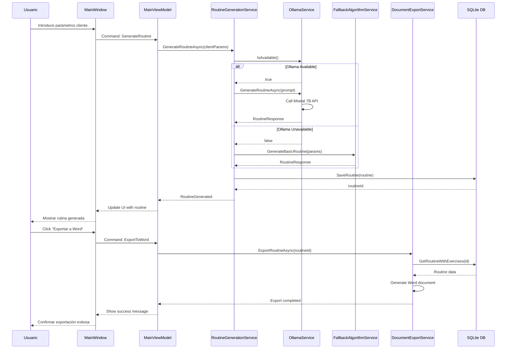

# GymRoutine Generator Architecture Document

## Introduction

### Starter Template or Existing Project Analysis

Revisando tu PRD, veo que tienes especificaciones técnicas muy claras para una **aplicación nativa de Windows**:

**Tecnologías Especificadas en el PRD:**
- **Frontend:** WinUI 3 con XAML (nativo Windows)
- **Backend:** .NET 8 con lógica de negocio integrada
- **Base de datos:** SQLite con Entity Framework Core
- **IA:** Ollama + Mistral 7B (local, offline)
- **Generación documentos:** DocumentFormat.OpenXml para Word
- **Patrón:** MVVM con data binding

**Decisión sobre Starter Template:**
No hay starter template específico mencionado. Para WinUI 3 + .NET 8, las opciones principales serían:

1. **Template oficial WinUI 3** (`dotnet new winui3`)
2. **WinUI 3 Template Studio** (Microsoft)
3. **Template desde cero** con estructura personalizada

**Recomendación:** Usar el template oficial `dotnet new winui3` como base y estructurarlo como monorepo con proyectos separados para UI, Business Logic, y Data Access siguiendo los principios de Clean Architecture adaptados para desktop.

### Change Log
| Date | Version | Description | Author |
|------|---------|-------------|--------|
| 2025-09-22 | 1.0 | Arquitectura inicial aplicación escritorio | Winston (Architect) |

Este documento define la arquitectura completa para **GymRoutine Generator**, una aplicación nativa de Windows que genera rutinas de ejercicio personalizadas usando IA local y exporta documentos Word profesionales. La arquitectura balanceada combina tecnologías modernas .NET con requisitos especializados como procesamiento IA offline y generación automática de documentos.

## High Level Architecture

### Technical Summary

GymRoutine Generator utiliza una **arquitectura monolítica nativa de Windows** basada en WinUI 3 y .NET 8, optimizada para operación completamente offline. El sistema integra un motor de IA local (Ollama + Mistral 7B) con una base de datos SQLite para generar rutinas personalizadas de ejercicio y exportarlas como documentos Word profesionales. La arquitectura emplea patrones MVVM para la UI, Repository para acceso a datos, y Service Layer para lógica de negocio, proporcionando separación clara de responsabilidades mientras mantiene la simplicidad operacional requerida para usuarios no técnicos.

### High Level Overview

**Estilo Arquitectónico:** Aplicación de escritorio monolítica con separación de capas bien definida
**Estructura de Repositorio:** Monorepo con proyectos separados por responsabilidad
**Arquitectura de Servicios:** Aplicación nativa integrada con servicios internos modulares
**Flujo Principal:** Usuario introduce parámetros → IA procesa → Genera rutina → Exporta a Word

**Decisiones Arquitectónicas Clave:**
1. **Local-First:** Todo el procesamiento ocurre localmente sin dependencias de internet
2. **AI-Enhanced:** Ollama proporciona inteligencia, con fallback algorítmico
3. **Document-Centric:** Exportación Word como output principal profesional
4. **Spanish-Native:** Interfaz y contenido completamente en español
5. **Performance-Optimized:** Designed para hardware mínimo (8GB RAM)

### High Level Project Diagram



### Architectural and Design Patterns

- **MVVM (Model-View-ViewModel):** Separación UI de lógica de negocio con data binding bidireccional - _Rationale:_ Patrón estándar WinUI 3, facilita testing y mantenabilidad
- **Repository Pattern:** Abstrae acceso a datos SQLite - _Rationale:_ Permite testing unitario y futuras migraciones de base de datos
- **Service Layer Pattern:** Encapsula lógica de negocio en servicios específicos - _Rationale:_ Separa responsabilidades y facilita reutilización entre ViewModels
- **Dependency Injection:** Container IoC nativo .NET para gestión de dependencias - _Rationale:_ Facilita testing, configuración y intercambio de implementaciones
- **Command Pattern:** Para acciones de UI con ICommand - _Rationale:_ Desacopla UI de lógica, soporta undo/redo y validación
- **Factory Pattern:** Para creación de rutinas basadas en parámetros - _Rationale:_ Encapsula lógica compleja de creación y permite diferentes estrategias
- **Strategy Pattern:** Para algoritmos de generación (AI vs fallback) - _Rationale:_ Permite switching dinámico entre motores de generación

## Tech Stack

### Cloud Infrastructure
- **Provider:** N/A - Aplicación Desktop Local
- **Key Services:** Ollama HTTP Server (localhost:11434), Windows File System
- **Deployment Regions:** Local Windows Machine

### Technology Stack Table

| Category | Technology | Version | Purpose | Rationale |
|----------|------------|---------|---------|-----------|
| **Platform** | Windows 10/11 | 1809+ | Target platform | Especificado en PRD para usuarios objetivo |
| **UI Framework** | WinUI 3 | 1.5.240311000 | Native Windows UI | Performance nativa, Fluent Design, accesibilidad |
| **Language** | C# | 12.0 | Primary development | Ecosistema .NET, strong typing, tooling excelente |
| **Runtime** | .NET | 8.0 LTS | Application runtime | LTS support, performance, WinUI 3 compatibility |
| **Database** | SQLite | 3.44.0 | Local data storage | Zero-config, portable, perfecto para desktop |
| **ORM** | Entity Framework Core | 8.0.0 | Data access | Code-first, migrations, LINQ integration |
| **AI Engine** | Ollama | 0.1.17 | Local AI server | Offline AI, model management, REST API |
| **AI Model** | Mistral 7B | Latest | Routine generation | Spanish support, good performance/size ratio |
| **Document Generation** | DocumentFormat.OpenXml | 3.0.0 | Word document creation | Official Microsoft library, full .docx support |
| **Image Processing** | ImageSharp | 3.0.2 | Exercise image optimization | Cross-platform, performance, format support |
| **HTTP Client** | HttpClient | Built-in .NET | Ollama communication | Native .NET, async/await, connection pooling |
| **Logging** | Serilog | 3.1.1 | Application logging | Structured logging, multiple sinks, configuración |
| **Dependency Injection** | Microsoft.Extensions.DI | 8.0.0 | IoC container | Built-in .NET, simple, sufficient |
| **Configuration** | Microsoft.Extensions.Configuration | 8.0.0 | App configuration | JSON config, environment variables |
| **Testing Framework** | MSTest | 3.2.0 | Unit testing | Microsoft official, VS integration |
| **Mocking** | Moq | 4.20.69 | Test doubles | Popular, fluent API, async support |
| **Build Tool** | MSBuild | Built-in | Project building | Native .NET, VS integration |
| **Package Manager** | NuGet | Built-in | Dependency management | Standard .NET package manager |
| **Installer** | WiX Toolset | 4.0 | Windows installer | Professional MSI creation, Windows standard |

## Data Models

### Exercise

**Purpose:** Representa un ejercicio individual con toda la información necesaria para rutinas y documentos

**Key Attributes:**
- Id: int - Identificador único del ejercicio
- Name: string - Nombre del ejercicio en español
- Description: string - Descripción detallada del ejercicio
- Instructions: string - Instrucciones paso a paso
- PrimaryMuscleGroup: MuscleGroup - Grupo muscular principal trabajado
- SecondaryMuscleGroups: List<MuscleGroup> - Grupos musculares secundarios
- EquipmentType: EquipmentType - Tipo de equipamiento requerido
- DifficultyLevel: DifficultyLevel - Nivel de dificultad (Principiante/Intermedio/Avanzado)
- ImagePaths: List<string> - Rutas a imágenes del ejercicio
- EstimatedDurationSeconds: int - Duración estimada en segundos
- IsActive: bool - Si el ejercicio está disponible para selección

**Relationships:**
- One-to-many con RoutineExercise
- Many-to-many con ExerciseVariation (ejercicios relacionados)

### Client

**Purpose:** Almacena información demográfica y preferencias del cliente para personalización

**Key Attributes:**
- Id: int - Identificador único del cliente
- Gender: Gender - Género del cliente (Hombre/Mujer/Otro)
- Age: int - Edad del cliente
- TrainingDaysPerWeek: int - Días de entrenamiento por semana (1-7)
- EquipmentPreferences: List<EquipmentType> - Equipamiento disponible
- MuscleGroupFocus: Dictionary<MuscleGroup, FocusLevel> - Enfoque por grupo muscular
- PhysicalLimitations: List<string> - Limitaciones físicas o lesiones
- IntensityLevel: IntensityLevel - Nivel de intensidad preferido
- ExerciseExclusions: List<int> - IDs de ejercicios a evitar
- CreatedDate: DateTime - Fecha de creación del perfil

**Relationships:**
- One-to-many con Routine

### Routine

**Purpose:** Representa una rutina completa generada para un cliente específico

**Key Attributes:**
- Id: int - Identificador único de la rutina
- ClientId: int - Referencia al cliente
- Name: string - Nombre descriptivo de la rutina
- GeneratedDate: DateTime - Fecha de generación
- GenerationMethod: GenerationMethod - AI o Algoritmo básico
- TotalEstimatedDuration: int - Duración total estimada en minutos
- Difficulty: DifficultyLevel - Nivel de dificultad general
- Notes: string - Notas adicionales generadas por IA
- IsExported: bool - Si ya fue exportada a Word
- ExportedFilePath: string - Ruta del archivo Word exportado

**Relationships:**
- Many-to-one con Client
- One-to-many con RoutineExercise

### RoutineExercise

**Purpose:** Relaciona ejercicios con rutinas incluyendo sets, reps y orden

**Key Attributes:**
- Id: int - Identificador único
- RoutineId: int - Referencia a la rutina
- ExerciseId: int - Referencia al ejercicio
- OrderInRoutine: int - Posición en la rutina
- Sets: int - Número de series
- Reps: string - Repeticiones (puede ser rango como "8-12")
- RestTimeSeconds: int - Tiempo de descanso entre series
- Weight: string - Peso sugerido (opcional)
- Notes: string - Notas específicas del ejercicio en esta rutina

**Relationships:**
- Many-to-one con Routine
- Many-to-one con Exercise

## Components

### MainWindow (UI Layer)

**Responsibility:** Ventana principal de la aplicación con navegación y contenido principal

**Key Interfaces:**
- IMainWindow - Contrato para operaciones de ventana principal
- INavigationService - Servicio de navegación entre vistas

**Dependencies:** MainViewModel, INavigationService, IDialogService

**Technology Stack:** WinUI 3 XAML, MVVM Toolkit, Dependency Injection

### MainViewModel (Presentation Layer)

**Responsibility:** ViewModel principal que coordina la lógica de presentación y comandos de UI

**Key Interfaces:**
- INotifyPropertyChanged - Para data binding
- ICommand implementations - Para acciones de usuario

**Dependencies:** IClientService, IRoutineGenerationService, IDocumentExportService

**Technology Stack:** CommunityToolkit.Mvvm, Reactive properties, Command patterns

### ClientService (Business Layer)

**Responsibility:** Gestión de perfiles de cliente y validación de parámetros de entrada

**Key Interfaces:**
- IClientService - Operaciones CRUD de clientes
- IClientValidator - Validación de datos de cliente

**Dependencies:** IClientRepository, ILogger

**Technology Stack:** FluentValidation, Entity Framework Core, Custom business logic

### RoutineGenerationService (Business Layer)

**Responsibility:** Orquesta la generación de rutinas usando AI o algoritmos de fallback

**Key Interfaces:**
- IRoutineGenerationService - Generación de rutinas
- IAIService - Interfaz para servicios de IA
- IFallbackAlgorithmService - Algoritmo básico de backup

**Dependencies:** IOllamaService, IExerciseService, IFallbackAlgorithmService, ILogger

**Technology Stack:** Strategy pattern, Async/await, HTTP clients

### OllamaService (Infrastructure Layer)

**Responsibility:** Comunicación con servidor Ollama local para generación IA de rutinas

**Key Interfaces:**
- IOllamaService - Operaciones con Ollama
- IHealthCheckService - Verificación estado del servicio

**Dependencies:** HttpClient, IConfiguration, ILogger

**Technology Stack:** HttpClient, JSON serialization, Retry policies, Circuit breaker

### ExerciseService (Business Layer)

**Responsibility:** Gestión de biblioteca de ejercicios, búsqueda y filtrado

**Key Interfaces:**
- IExerciseService - Operaciones con ejercicios
- IExerciseSearchService - Búsqueda y filtrado

**Dependencies:** IExerciseRepository, IImageService, ILogger

**Technology Stack:** LINQ queries, Repository pattern, Image processing

### DocumentExportService (Business Layer)

**Responsibility:** Generación de documentos Word profesionales con rutinas e imágenes

**Key Interfaces:**
- IDocumentExportService - Exportación de documentos
- ITemplateService - Gestión de plantillas

**Dependencies:** IDocumentGenerator, IImageService, ITemplateRepository

**Technology Stack:** DocumentFormat.OpenXml, Template engine, File I/O

### DataContext (Data Layer)

**Responsibility:** Contexto Entity Framework para acceso a base de datos SQLite

**Key Interfaces:**
- DbContext - Contexto EF Core
- IUnitOfWork - Patrón Unit of Work

**Dependencies:** SQLite provider, Entity configurations

**Technology Stack:** Entity Framework Core, SQLite, Code-first migrations

## Component Diagrams



## External APIs

### Ollama Local AI API

- **Purpose:** Generación inteligente de rutinas usando modelo Mistral 7B local
- **Documentation:** https://github.com/ollama/ollama/blob/main/docs/api.md
- **Base URL(s):** http://localhost:11434
- **Authentication:** None (local service)
- **Rate Limits:** No limits (local)

**Key Endpoints Used:**
- `POST /api/generate` - Generar rutina basada en prompt con parámetros
- `GET /api/tags` - Verificar modelos disponibles
- `POST /api/pull` - Descargar modelo Mistral 7B si no existe
- `GET /` - Health check del servicio

**Integration Notes:**
- Timeout de 30 segundos para generación
- Retry logic con exponential backoff
- Fallback automático si servicio no disponible
- Prompts estructurados en español para rutinas fitness

## Core Workflows



## Database Schema

```sql
-- Tabla de ejercicios con información completa
CREATE TABLE Exercises (
    Id INTEGER PRIMARY KEY AUTOINCREMENT,
    Name NVARCHAR(200) NOT NULL,
    Description NVARCHAR(1000),
    Instructions NVARCHAR(2000),
    PrimaryMuscleGroup INTEGER NOT NULL,
    EquipmentType INTEGER NOT NULL,
    DifficultyLevel INTEGER NOT NULL,
    EstimatedDurationSeconds INTEGER DEFAULT 0,
    IsActive BOOLEAN DEFAULT 1,
    CreatedDate DATETIME DEFAULT CURRENT_TIMESTAMP,
    ModifiedDate DATETIME DEFAULT CURRENT_TIMESTAMP
);

-- Grupos musculares secundarios (many-to-many)
CREATE TABLE ExerciseSecondaryMuscles (
    ExerciseId INTEGER NOT NULL,
    MuscleGroup INTEGER NOT NULL,
    PRIMARY KEY (ExerciseId, MuscleGroup),
    FOREIGN KEY (ExerciseId) REFERENCES Exercises(Id) ON DELETE CASCADE
);

-- Imágenes de ejercicios
CREATE TABLE ExerciseImages (
    Id INTEGER PRIMARY KEY AUTOINCREMENT,
    ExerciseId INTEGER NOT NULL,
    ImagePath NVARCHAR(500) NOT NULL,
    ImageType INTEGER DEFAULT 0, -- 0: Principal, 1: Inicio, 2: Medio, 3: Final
    OrderIndex INTEGER DEFAULT 0,
    FOREIGN KEY (ExerciseId) REFERENCES Exercises(Id) ON DELETE CASCADE
);

-- Perfiles de clientes
CREATE TABLE Clients (
    Id INTEGER PRIMARY KEY AUTOINCREMENT,
    Gender INTEGER NOT NULL,
    Age INTEGER NOT NULL CHECK (Age >= 16 AND Age <= 100),
    TrainingDaysPerWeek INTEGER NOT NULL CHECK (TrainingDaysPerWeek >= 1 AND TrainingDaysPerWeek <= 7),
    IntensityLevel INTEGER NOT NULL,
    PhysicalLimitations NVARCHAR(1000),
    CreatedDate DATETIME DEFAULT CURRENT_TIMESTAMP
);

-- Preferencias de equipamiento del cliente
CREATE TABLE ClientEquipmentPreferences (
    ClientId INTEGER NOT NULL,
    EquipmentType INTEGER NOT NULL,
    PRIMARY KEY (ClientId, EquipmentType),
    FOREIGN KEY (ClientId) REFERENCES Clients(Id) ON DELETE CASCADE
);

-- Enfoque muscular del cliente
CREATE TABLE ClientMuscleGroupFocus (
    ClientId INTEGER NOT NULL,
    MuscleGroup INTEGER NOT NULL,
    FocusLevel INTEGER NOT NULL, -- 1: Bajo, 2: Medio, 3: Alto
    PRIMARY KEY (ClientId, MuscleGroup),
    FOREIGN KEY (ClientId) REFERENCES Clients(Id) ON DELETE CASCADE
);

-- Ejercicios excluidos por cliente
CREATE TABLE ClientExerciseExclusions (
    ClientId INTEGER NOT NULL,
    ExerciseId INTEGER NOT NULL,
    Reason NVARCHAR(500),
    PRIMARY KEY (ClientId, ExerciseId),
    FOREIGN KEY (ClientId) REFERENCES Clients(Id) ON DELETE CASCADE,
    FOREIGN KEY (ExerciseId) REFERENCES Exercises(Id) ON DELETE CASCADE
);

-- Rutinas generadas
CREATE TABLE Routines (
    Id INTEGER PRIMARY KEY AUTOINCREMENT,
    ClientId INTEGER NOT NULL,
    Name NVARCHAR(300) NOT NULL,
    GeneratedDate DATETIME DEFAULT CURRENT_TIMESTAMP,
    GenerationMethod INTEGER NOT NULL, -- 0: AI, 1: Fallback
    TotalEstimatedDuration INTEGER DEFAULT 0,
    Difficulty INTEGER NOT NULL,
    Notes NVARCHAR(2000),
    IsExported BOOLEAN DEFAULT 0,
    ExportedFilePath NVARCHAR(1000),
    FOREIGN KEY (ClientId) REFERENCES Clients(Id)
);

-- Ejercicios en rutinas con detalles específicos
CREATE TABLE RoutineExercises (
    Id INTEGER PRIMARY KEY AUTOINCREMENT,
    RoutineId INTEGER NOT NULL,
    ExerciseId INTEGER NOT NULL,
    OrderInRoutine INTEGER NOT NULL,
    Sets INTEGER NOT NULL CHECK (Sets > 0),
    Reps NVARCHAR(50) NOT NULL, -- "8-12", "15", "30 segundos"
    RestTimeSeconds INTEGER DEFAULT 60,
    Weight NVARCHAR(50), -- "10kg", "Peso corporal", "50% 1RM"
    Notes NVARCHAR(500),
    FOREIGN KEY (RoutineId) REFERENCES Routines(Id) ON DELETE CASCADE,
    FOREIGN KEY (ExerciseId) REFERENCES Exercises(Id),
    UNIQUE(RoutineId, OrderInRoutine)
);

-- Índices para optimización
CREATE INDEX IX_Exercises_MuscleGroup ON Exercises(PrimaryMuscleGroup);
CREATE INDEX IX_Exercises_Equipment ON Exercises(EquipmentType);
CREATE INDEX IX_Exercises_Difficulty ON Exercises(DifficultyLevel);
CREATE INDEX IX_Routines_Client ON Routines(ClientId);
CREATE INDEX IX_Routines_Generated ON Routines(GeneratedDate);
CREATE INDEX IX_RoutineExercises_Routine ON RoutineExercises(RoutineId);
```

## Source Tree

```
GymRoutineGenerator/
├── src/
│   ├── GymRoutineGenerator.UI/           # WinUI 3 Application
│   │   ├── Views/
│   │   │   ├── MainWindow.xaml           # Ventana principal
│   │   │   ├── RoutineGenerationView.xaml # Vista generación rutinas
│   │   │   ├── SettingsView.xaml         # Vista configuración
│   │   │   └── Controls/                 # UserControls reutilizables
│   │   │       ├── ClientParametersControl.xaml
│   │   │       ├── RoutineDisplayControl.xaml
│   │   │       └── ProgressIndicatorControl.xaml
│   │   ├── ViewModels/
│   │   │   ├── MainViewModel.cs          # ViewModel principal
│   │   │   ├── RoutineGenerationViewModel.cs
│   │   │   ├── SettingsViewModel.cs
│   │   │   └── Base/
│   │   │       └── ViewModelBase.cs      # Base para ViewModels
│   │   ├── Services/
│   │   │   ├── INavigationService.cs
│   │   │   ├── NavigationService.cs
│   │   │   ├── IDialogService.cs
│   │   │   └── DialogService.cs
│   │   ├── Converters/                   # Value converters para XAML
│   │   │   ├── BoolToVisibilityConverter.cs
│   │   │   └── EnumToStringConverter.cs
│   │   ├── Styles/
│   │   │   ├── Generic.xaml              # Estilos globales
│   │   │   └── Controls.xaml             # Estilos controles custom
│   │   ├── App.xaml                      # Aplicación principal
│   │   ├── App.xaml.cs
│   │   └── Package.appxmanifest          # Manifiesto WinUI 3
│   │
│   ├── GymRoutineGenerator.Business/     # Business Logic Layer
│   │   ├── Services/
│   │   │   ├── IClientService.cs
│   │   │   ├── ClientService.cs
│   │   │   ├── IRoutineGenerationService.cs
│   │   │   ├── RoutineGenerationService.cs
│   │   │   ├── IExerciseService.cs
│   │   │   ├── ExerciseService.cs
│   │   │   ├── IDocumentExportService.cs
│   │   │   ├── DocumentExportService.cs
│   │   │   ├── IFallbackAlgorithmService.cs
│   │   │   └── FallbackAlgorithmService.cs
│   │   ├── Models/
│   │   │   ├── ClientParameters.cs
│   │   │   ├── RoutineRequest.cs
│   │   │   ├── RoutineResponse.cs
│   │   │   └── GenerationSettings.cs
│   │   ├── Validators/
│   │   │   ├── ClientParametersValidator.cs
│   │   │   └── RoutineRequestValidator.cs
│   │   └── Extensions/
│   │       ├── ServiceCollectionExtensions.cs
│   │       └── ModelExtensions.cs
│   │
│   ├── GymRoutineGenerator.Infrastructure/ # Infrastructure Layer
│   │   ├── AI/
│   │   │   ├── IOllamaService.cs
│   │   │   ├── OllamaService.cs
│   │   │   ├── Models/
│   │   │   │   ├── OllamaRequest.cs
│   │   │   │   ├── OllamaResponse.cs
│   │   │   │   └── ModelInfo.cs
│   │   │   └── Prompts/
│   │   │       ├── RoutineGenerationPrompts.cs
│   │   │       └── PromptTemplates.cs
│   │   ├── Documents/
│   │   │   ├── IDocumentGenerator.cs
│   │   │   ├── WordDocumentGenerator.cs
│   │   │   ├── ITemplateService.cs
│   │   │   ├── TemplateService.cs
│   │   │   └── Templates/
│   │   │       ├── BasicRoutineTemplate.cs
│   │   │       └── ProfessionalRoutineTemplate.cs
│   │   ├── Images/
│   │   │   ├── IImageService.cs
│   │   │   ├── ImageService.cs
│   │   │   └── ImageProcessor.cs
│   │   ├── Configuration/
│   │   │   ├── AppSettings.cs
│   │   │   └── OllamaSettings.cs
│   │   └── Extensions/
│   │       └── ServiceCollectionExtensions.cs
│   │
│   ├── GymRoutineGenerator.Data/         # Data Access Layer
│   │   ├── Context/
│   │   │   ├── GymRoutineContext.cs      # DbContext principal
│   │   │   └── DesignTimeDbContextFactory.cs
│   │   ├── Entities/
│   │   │   ├── Client.cs
│   │   │   ├── Exercise.cs
│   │   │   ├── Routine.cs
│   │   │   ├── RoutineExercise.cs
│   │   │   ├── ExerciseImage.cs
│   │   │   └── Base/
│   │   │       └── BaseEntity.cs
│   │   ├── Configurations/
│   │   │   ├── ClientConfiguration.cs
│   │   │   ├── ExerciseConfiguration.cs
│   │   │   ├── RoutineConfiguration.cs
│   │   │   └── RoutineExerciseConfiguration.cs
│   │   ├── Repositories/
│   │   │   ├── IRepository.cs
│   │   │   ├── Repository.cs
│   │   │   ├── IClientRepository.cs
│   │   │   ├── ClientRepository.cs
│   │   │   ├── IExerciseRepository.cs
│   │   │   ├── ExerciseRepository.cs
│   │   │   ├── IRoutineRepository.cs
│   │   │   └── RoutineRepository.cs
│   │   ├── Migrations/                   # EF Core migrations
│   │   ├── Seeds/
│   │   │   ├── ExerciseSeeder.cs
│   │   │   └── SeedData.json
│   │   └── Extensions/
│   │       └── ServiceCollectionExtensions.cs
│   │
│   └── GymRoutineGenerator.Core/         # Shared/Common
│       ├── Enums/
│       │   ├── Gender.cs
│       │   ├── MuscleGroup.cs
│       │   ├── EquipmentType.cs
│       │   ├── DifficultyLevel.cs
│       │   ├── IntensityLevel.cs
│       │   ├── FocusLevel.cs
│       │   └── GenerationMethod.cs
│       ├── Exceptions/
│       │   ├── GymRoutineException.cs
│       │   ├── OllamaServiceException.cs
│       │   └── DocumentGenerationException.cs
│       ├── Constants/
│       │   ├── ApplicationConstants.cs
│       │   ├── DatabaseConstants.cs
│       │   └── OllamaConstants.cs
│       └── Extensions/
│           ├── EnumExtensions.cs
│           └── StringExtensions.cs
│
├── tests/
│   ├── GymRoutineGenerator.Tests.Unit/   # Unit tests
│   │   ├── Business/
│   │   │   ├── ClientServiceTests.cs
│   │   │   ├── RoutineGenerationServiceTests.cs
│   │   │   └── DocumentExportServiceTests.cs
│   │   ├── Infrastructure/
│   │   │   ├── OllamaServiceTests.cs
│   │   │   └── WordDocumentGeneratorTests.cs
│   │   ├── Data/
│   │   │   └── RepositoryTests.cs
│   │   └── Mocks/
│   │       ├── MockOllamaService.cs
│   │       └── MockDbContext.cs
│   │
│   ├── GymRoutineGenerator.Tests.Integration/ # Integration tests
│   │   ├── AI/
│   │   │   └── OllamaIntegrationTests.cs
│   │   ├── Data/
│   │   │   └── DatabaseIntegrationTests.cs
│   │   └── Documents/
│   │       └── WordGenerationTests.cs
│   │
│   └── GymRoutineGenerator.Tests.E2E/    # End-to-end tests
│       ├── FullWorkflowTests.cs
│       └── UserScenarioTests.cs
│
├── assets/
│   ├── exercises/                        # Imágenes de ejercicios
│   │   ├── chest/
│   │   ├── back/
│   │   ├── shoulders/
│   │   ├── arms/
│   │   ├── legs/
│   │   └── core/
│   ├── templates/                        # Plantillas Word
│   │   ├── basic-routine-template.docx
│   │   └── professional-template.docx
│   └── icons/
│       ├── app-icon.ico
│       └── exercise-icons/
│
├── docs/
│   ├── architecture.md                   # Este documento
│   ├── prd.md
│   ├── front-end-spec.md
│   ├── setup-guide.md
│   └── user-manual.md
│
├── scripts/
│   ├── build.ps1                         # Script de build
│   ├── setup-ollama.ps1                  # Script instalación Ollama
│   ├── database-setup.ps1                # Script setup base datos
│   └── package.ps1                       # Script empaquetado
│
├── installer/
│   ├── wix/                              # WiX installer files
│   │   ├── Product.wxs
│   │   ├── Components.wxs
│   │   └── UI.wxs
│   └── setup-script.iss                  # Inno Setup alternative
│
├── .gitignore
├── .editorconfig
├── Directory.Build.props                 # MSBuild properties
├── GymRoutineGenerator.sln               # Solution file
├── README.md
└── LICENSE
```

## Infrastructure and Deployment

### Infrastructure as Code
- **Tool:** PowerShell Scripts
- **Location:** `/scripts/`
- **Approach:** Desktop application deployment scripts

### Deployment Strategy
- **Strategy:** Desktop application installer with automated dependencies
- **CI/CD Platform:** GitHub Actions
- **Pipeline Configuration:** `.github/workflows/build-and-release.yml`

### Environments
- **Development:** Local development machine with Visual Studio
- **Testing:** Automated testing in CI pipeline
- **Production:** End-user Windows machines via installer

### Environment Promotion Flow
```
Developer Machine → GitHub → CI Build → Release Artifacts → User Installation
```

### Rollback Strategy
- **Primary Method:** Version rollback via Windows Programs & Features
- **Trigger Conditions:** Critical bugs, user reports, compatibility issues
- **Recovery Time Objective:** Immediate (user-initiated uninstall/reinstall)

## Error Handling Strategy

### General Approach
- **Error Model:** Exception-based with structured error responses
- **Exception Hierarchy:** Custom exceptions inheriting from GymRoutineException base
- **Error Propagation:** Bubble up through layers with context preservation

### Logging Standards
- **Library:** Serilog 3.1.1
- **Format:** Structured JSON logging with Spanish error messages for users
- **Levels:** Verbose, Debug, Information, Warning, Error, Fatal
- **Required Context:**
  - Correlation ID: GUID per operation
  - Service Context: Layer and component name
  - User Context: Anonymized client parameters (no PII)

### Error Handling Patterns

#### External API Errors
- **Retry Policy:** Exponential backoff with 3 retries for Ollama
- **Circuit Breaker:** Open circuit after 5 consecutive failures
- **Timeout Configuration:** 30 seconds for AI generation, 5 seconds for health checks
- **Error Translation:** Map HTTP errors to user-friendly Spanish messages

#### Business Logic Errors
- **Custom Exceptions:** ClientValidationException, RoutineGenerationException, DocumentExportException
- **User-Facing Errors:** Translated to Spanish with actionable guidance
- **Error Codes:** Numeric codes for logging, Spanish messages for UI

#### Data Consistency
- **Transaction Strategy:** Unit of Work pattern with automatic rollback
- **Compensation Logic:** Cleanup partial data on failed operations
- **Idempotency:** Safe retry for document generation and data operations

## Coding Standards

### Core Standards
- **Languages & Runtimes:** C# 12.0, .NET 8.0 LTS
- **Style & Linting:** EditorConfig + Roslyn analyzers + StyleCop
- **Test Organization:** Test files in parallel structure with `.Tests` suffix

### Naming Conventions

| Element | Convention | Example |
|---------|------------|---------|
| Classes | PascalCase | `RoutineGenerationService` |
| Interfaces | PascalCase with I prefix | `IClientService` |
| Methods | PascalCase | `GenerateRoutineAsync` |
| Properties | PascalCase | `ClientParameters` |
| Fields | camelCase with _ prefix | `_logger` |
| Constants | PascalCase | `DefaultTimeoutSeconds` |
| Enums | PascalCase | `MuscleGroup.Chest` |

### Critical Rules
- **Async Suffix:** All async methods must end with "Async"
- **ConfigureAwait(false):** Use in all library code, not in UI code
- **Null Checking:** Use null-conditional operators and nullable reference types
- **Resource Disposal:** Use `using` statements for IDisposable objects
- **Exception Wrapping:** Wrap external exceptions in domain-specific exceptions
- **Spanish User Messages:** All user-facing text must be in Spanish
- **Logging:** Use structured logging with Serilog, no Console.WriteLine
- **Database Queries:** Always use parameterized queries through EF Core

## Test Strategy and Standards

### Testing Philosophy
- **Approach:** Test-first development with comprehensive coverage
- **Coverage Goals:** 80%+ unit test coverage, 60%+ integration coverage
- **Test Pyramid:** 70% unit tests, 20% integration tests, 10% E2E tests

### Test Types and Organization

#### Unit Tests
- **Framework:** MSTest 3.2.0
- **File Convention:** `{ClassUnderTest}Tests.cs`
- **Location:** `tests/GymRoutineGenerator.Tests.Unit/`
- **Mocking Library:** Moq 4.20.69
- **Coverage Requirement:** 80% minimum

**AI Agent Requirements:**
- Generate tests for all public methods
- Cover edge cases and error conditions
- Follow AAA pattern (Arrange, Act, Assert)
- Mock all external dependencies

#### Integration Tests
- **Scope:** Service-to-service and database integration
- **Location:** `tests/GymRoutineGenerator.Tests.Integration/`
- **Test Infrastructure:**
  - **Database:** In-memory SQLite for integration tests
  - **Ollama:** Mock service for CI, real service for local testing
  - **File System:** Temporary directories for document generation

#### End-to-End Tests
- **Framework:** MSTest with WinUI 3 testing extensions
- **Scope:** Complete user workflows from UI to document export
- **Environment:** Local Windows environment with real dependencies
- **Test Data:** Scripted test scenarios with known expected outputs

### Test Data Management
- **Strategy:** Builder pattern for test object creation
- **Fixtures:** JSON seed data in `tests/TestData/`
- **Factories:** `TestDataFactory` for creating test entities
- **Cleanup:** Automatic cleanup after each test

### Continuous Testing
- **CI Integration:** All tests run on pull requests and main branch
- **Performance Tests:** Load testing for AI generation and document export
- **Security Tests:** Static analysis with CodeQL in GitHub Actions

## Security

### Input Validation
- **Validation Library:** FluentValidation
- **Validation Location:** At service boundaries before processing
- **Required Rules:**
  - All user inputs must be validated against defined constraints
  - Age must be 16-100, training days 1-7
  - String length limits enforced to prevent buffer overflows

### Authentication & Authorization
- **Auth Method:** Not applicable - single-user desktop application
- **Session Management:** Application-level state management only
- **Required Patterns:**
  - No authentication required for desktop app
  - File system access controlled by Windows permissions

### Secrets Management
- **Development:** appsettings.Development.json (not committed)
- **Production:** Windows User Profile settings storage
- **Code Requirements:**
  - No hardcoded secrets in code
  - Configuration through IConfiguration only
  - No sensitive data in logs

### API Security
- **Rate Limiting:** Not applicable - local services only
- **CORS Policy:** Not applicable - no web APIs exposed
- **Security Headers:** Not applicable - desktop application
- **HTTPS Enforcement:** Ollama uses HTTP locally (localhost only)

### Data Protection
- **Encryption at Rest:** Windows DPAPI for sensitive configuration
- **Encryption in Transit:** Not applicable - local communication only
- **PII Handling:** Minimal PII collection, no external transmission
- **Logging Restrictions:** No client names, ages, or personal identifiers in logs

### Dependency Security
- **Scanning Tool:** GitHub Dependabot for NuGet packages
- **Update Policy:** Monthly security updates, quarterly feature updates
- **Approval Process:** Security updates auto-approved, others require review

### Security Testing
- **SAST Tool:** CodeQL analysis in GitHub Actions
- **DAST Tool:** Not applicable - no web surface
- **Penetration Testing:** Annual security review of installer and file handling

## Next Steps

### Architect Prompt
Para proyectos que requieren interfaz de usuario, procede con:

**Prompt para Frontend Architecture:**
"Crear arquitectura frontend detallada para GymRoutine Generator basada en este documento de arquitectura. Enfócate en:
- Implementación específica WinUI 3 + MVVM
- Estructura de ViewModels y Views
- Data binding y comando patterns
- Integración con Business Layer
- Accesibilidad para usuarios 50+ años
- Interfaz completamente en español
- Requisitos del UI/UX specification document"

**Referencias:**
- Este documento de arquitectura como base técnica
- docs/front-end-spec.md para requisitos de interfaz
- docs/prd.md para objetivos funcionales

**Decisiones clave ya tomadas aquí:**
- Tech stack: WinUI 3 + .NET 8 + MVVM
- Patrones: Dependency Injection + Repository + Service Layer
- Estructura de proyecto y separación de capas