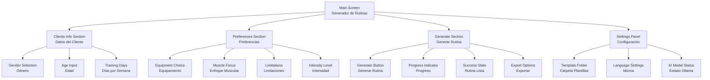
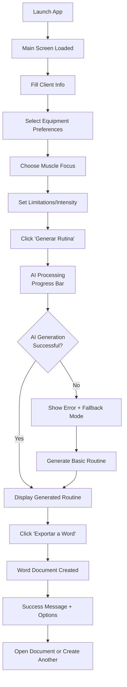

# GymRoutine Generator UI/UX Specification

This document defines the user experience goals, information architecture, user flows, and visual design specifications for GymRoutine Generator's user interface. It serves as the foundation for visual design and frontend development, ensuring a cohesive and user-centered experience.

## Overall UX Goals & Principles

### Target User Personas

**Primary User - Gym Owner/Personal Trainer:**
- Professional who needs to generate client routines quickly (reduce from 30 to 5 minutes)
- Familiar with fitness concepts but may have limited technical skills
- Values efficiency, professionalism, and client satisfaction
- Needs offline, reliable tool for their business

**Secondary User - Non-Technical User (like your mother):**
- Age 50+, minimal technical experience
- Needs ultra-simple interface with clear guidance
- Values clarity over complexity, large buttons, high contrast
- Should be able to use without training or support

### Usability Goals

1. **Ease of learning:** Non-technical users can generate their first routine within 5 minutes
2. **Efficiency of use:** Experienced users complete routine generation in under 2 minutes
3. **Error prevention:** Clear validation and helpful guidance prevent user mistakes
4. **Memorability:** Infrequent users can return without relearning the interface
5. **Accessibility:** WCAG AA compliance for users with varying abilities

### Design Principles

1. **"Grandmother-friendly" simplicity** - Every interface element must be intuitive to users aged 50+ with minimal tech experience
2. **Single-screen workflow** - Avoid navigation complexity by keeping all essential functions visible
3. **Immediate feedback** - Every action provides clear, instant visual confirmation in Spanish
4. **Progressive disclosure** - Show only essential options initially, with advanced features easily accessible but not overwhelming
5. **Professional output** - Despite simple input, generate polished, business-ready documents

## Information Architecture (IA)

### Site Map / Screen Inventory

### Navigation Structure

**Primary Navigation:** Single main screen eliminates traditional navigation. All functions accessible through clearly labeled sections arranged vertically for logical flow.

**Secondary Navigation:** Minimal tabbed sections within preferences (Equipamiento, Músculos, Limitaciones) using large, clearly labeled tabs in Spanish.

**Breadcrumb Strategy:** Not applicable - single-screen design prevents navigation depth. Current section highlighted with visual emphasis and progress indicators.

## User Flows

### Primary User Flow: Generate Workout Routine

**User Goal:** Create a personalized workout routine for a client and export it to Word document

**Entry Points:** Application launch (desktop shortcut), or "Nueva Rutina" button

**Success Criteria:** Professional Word document generated with client's personalized routine including exercise images

#### Flow Diagram

#### Edge Cases & Error Handling:
- **Ollama/AI unavailable:** Automatic fallback to rule-based algorithm with clear "Modo Básico" indicator
- **Invalid age input:** Real-time validation with helpful Spanish error messages
- **No equipment selected:** Defaults to "Peso Corporal" with notification
- **Conflicting limitations:** Smart conflict resolution with user confirmation
- **Word export failure:** Clear error message with alternative save locations
- **Missing exercise images:** Placeholder images with routine still functional

**Notes:** This flow prioritizes the 30-to-5-minute efficiency goal while maintaining the grandmother-friendly principle through clear visual feedback at each step.

## Wireframes & Mockups

**Primary Design Files:** Since this is a desktop WinUI 3 application, I recommend using **Figma** for wireframes and mockups due to its excellent desktop UI component libraries and collaboration features. Alternative: **Sketch** with Windows UI kits.

### Key Screen Layouts

#### Main Application Screen

**Purpose:** Single-screen workflow containing all functionality for routine generation

**Key Elements:**
- Large header with app title "Generador de Rutinas de Gym"
- Client info section with oversized input controls (gender radio buttons, age field, training days selector)
- Tabbed preferences section with visual icons for equipment/muscle groups
- Prominent "Generar Rutina" button (minimum 60px height) with loading state
- Results area that displays generated routine with clear typography
- Export section with "Exportar a Word" button and status feedback

**Interaction Notes:** All controls use minimum 44px touch targets, high contrast colors for 50+ age group, immediate visual feedback for all interactions, progressive disclosure keeps advanced options collapsed initially

**Design File Reference:** [Link to main-screen-desktop.fig frame in Figma]

#### Settings/Configuration Panel

**Purpose:** Minimal configuration for template folders and preferences

**Key Elements:**
- Template folder browser with large "Seleccionar Carpeta" button
- Ollama status indicator (green/red with clear labels)
- Language selector (currently Spanish only)
- Simple reset/defaults option

**Interaction Notes:** Overlay panel or sidebar, easy to dismiss, clear save/cancel actions

**Design File Reference:** [Link to settings-panel.fig frame in Figma]

## Component Library / Design System

**Design System Approach:** Hybrid approach using **WinUI 3 Fluent Design** as foundation with custom accessibility-enhanced components for your target demographic (50+ users). This provides native Windows feel while ensuring optimal usability for less technical users.

### Core Components

#### Large Action Button
**Purpose:** Primary actions like "Generar Rutina" and "Exportar a Word"

**Variants:**
- Primary (solid background)
- Secondary (outlined)
- Disabled state

**States:** Default, Hover, Pressed, Loading (with spinner), Disabled

**Usage Guidelines:** Minimum 60px height, 16px font size, high contrast colors, clear action-oriented Spanish labels, loading spinner for operations over 2 seconds

#### Client Info Card
**Purpose:** Grouped input section for demographic information

**Variants:**
- Collapsed (shows summary)
- Expanded (shows all inputs)

**States:** Empty, Partially filled, Complete, Error

**Usage Guidelines:** Clear section headers in Spanish, visual grouping with subtle borders, progress indicators show completion status

#### Equipment Selector Grid
**Purpose:** Visual selection of available gym equipment

**Variants:**
- Checkbox grid view
- List view for screen readers

**States:** Unselected, Selected, Hover, Disabled

**Usage Guidelines:** Large touch targets (44px minimum), equipment icons with Spanish labels, "Seleccionar Todo" convenience option

#### Progress Indicator
**Purpose:** Show AI routine generation progress

**Variants:**
- Determinate (known progress)
- Indeterminate (unknown duration)
- Success state
- Error state

**States:** Loading, Success, Error, Hidden

**Usage Guidelines:** Clear Spanish status messages, estimated time remaining, smooth animations that don't distract from accessibility

## Branding & Style Guide

### Visual Identity
**Brand Guidelines:** Clean, professional appearance reflecting fitness industry standards with emphasis on accessibility and trustworthiness for business use.

### Color Palette

| Color Type | Hex Code | Usage |
|------------|----------|--------|
| Primary | #2E7D32 | Main action buttons, headers, fitness/health association |
| Secondary | #1976D2 | Secondary buttons, links, accent elements |
| Accent | #FF8F00 | Success states, highlights, call-to-action elements |
| Success | #4CAF50 | Positive feedback, confirmations, completed states |
| Warning | #FF9800 | Cautions, important notices, validation messages |
| Error | #F44336 | Errors, destructive actions, validation failures |
| Neutral | #424242, #757575, #E0E0E0 | Text, borders, backgrounds, subtle elements |

### Typography

#### Font Families
- **Primary:** Segoe UI (native Windows, excellent readability)
- **Secondary:** Segoe UI Semibold (headers, emphasis)
- **Monospace:** Consolas (technical information, if needed)

#### Type Scale

| Element | Size | Weight | Line Height |
|---------|------|---------|-------------|
| H1 | 28px | Semibold | 1.3 |
| H2 | 24px | Semibold | 1.3 |
| H3 | 20px | Semibold | 1.4 |
| Body | 16px | Regular | 1.5 |
| Small | 14px | Regular | 1.4 |

### Iconography
**Icon Library:** Fluent UI Icons (Microsoft's native icon set for WinUI 3) supplemented with fitness-specific icons

**Usage Guidelines:** Icons paired with text labels in Spanish, minimum 24px size for touch targets, high contrast for visibility

### Spacing & Layout
**Grid System:** 8px base grid system aligned with WinUI 3 design standards

**Spacing Scale:** 8px, 16px, 24px, 32px, 48px, 64px increments for consistent visual rhythm

## Accessibility Requirements

### Compliance Target
**Standard:** WCAG 2.1 AA compliance with enhanced considerations for aging users and desktop application patterns

### Key Requirements

**Visual:**
- Color contrast ratios: Minimum 4.5:1 for normal text, 3:1 for large text (exceeding WCAG AA)
- Focus indicators: High-contrast 3px outline with rounded corners, visible on all interactive elements
- Text sizing: Base 16px minimum, scalable up to 200% without horizontal scrolling

**Interaction:**
- Keyboard navigation: Full application accessible via Tab, Enter, Space, Arrow keys, with logical focus order
- Screen reader support: Proper ARIA labels, roles, and live regions for dynamic content in Spanish
- Touch targets: Minimum 44px x 44px for all interactive elements, 8px spacing between targets

**Content:**
- Alternative text: Descriptive alt text for all exercise images and icons in Spanish
- Heading structure: Logical H1-H6 hierarchy maintaining semantic meaning
- Form labels: Clear, descriptive labels associated with all input controls

### Testing Strategy
**Manual Testing:** Keyboard-only navigation testing, screen reader testing with NVDA/JAWS, high contrast mode verification

**Automated Testing:** Integration with accessibility testing tools during development, color contrast validation, focus management verification

**User Testing:** Validation with 3+ users aged 50+ including at least one user with vision/motor challenges

## Responsiveness Strategy

### Breakpoints

| Breakpoint | Min Width | Max Width | Target Devices |
|------------|-----------|-----------|----------------|
| Compact | 800px | 1199px | Small desktop monitors, laptop screens |
| Medium | 1200px | 1599px | Standard desktop monitors (1080p) |
| Large | 1600px | 2399px | Large desktop monitors (1440p) |
| Wide | 2400px | - | Ultra-wide and 4K displays |

### Adaptation Patterns

**Layout Changes:**
- Compact: Single-column layout with stacked sections, collapsed preferences by default
- Medium/Large: Two-column layout with client info left, preferences/results right
- Wide: Three-column layout adding settings sidebar for quick access

**Navigation Changes:**
- Compact: Hamburger menu for settings, full-width sections
- Medium+: Persistent settings gear icon, side-by-side section layout
- Wide: Dedicated settings panel always visible

**Content Priority:**
- Compact: Progressive disclosure hides advanced options, essential inputs only
- Medium+: All preferences visible simultaneously, advanced options expanded
- Wide: Additional context panels, exercise preview thumbnails

**Interaction Changes:**
- All sizes maintain 44px minimum touch targets for potential touchscreen Windows devices
- Compact: Larger vertical spacing, simplified multi-step workflow
- Wide: Keyboard shortcuts displayed, enhanced hover states for mouse interaction

## Animation & Micro-interactions

### Motion Principles
**Accessibility First:** All animations respect `prefers-reduced-motion` settings, with instant alternatives for users with vestibular disorders. **Purposeful Motion:** Every animation serves a functional purpose (feedback, guidance, or status) rather than decoration. **Performance Conscious:** Smooth 60fps animations that don't impact Ollama/AI processing or slower hardware.

### Key Animations

- **Button Press Feedback:** Subtle scale transform (0.98x) with immediate spring back (Duration: 150ms, Easing: ease-out)
- **Form Validation:** Error shake animation for invalid inputs with color transition (Duration: 300ms, Easing: ease-in-out)
- **Progress Indicator:** Smooth indeterminate progress bar during AI generation (Duration: 2000ms loop, Easing: linear)
- **Success State:** Gentle fade-in with scale for completion confirmation (Duration: 400ms, Easing: ease-out)
- **Section Transitions:** Accordion-style expand/collapse for preference sections (Duration: 250ms, Easing: ease-in-out)
- **Loading States:** Skeleton screens for exercise image loading with pulse effect (Duration: 1500ms loop, Easing: ease-in-out)
- **Focus Indicators:** Smooth border color transitions for keyboard navigation (Duration: 200ms, Easing: ease-out)
- **Tooltip Appearance:** Fade-in with slight upward movement for help text (Duration: 200ms, Easing: ease-out)

## Performance Considerations

### Performance Goals
- **Page Load:** Application startup under 5 seconds on minimum hardware (8GB RAM)
- **Interaction Response:** UI interactions respond within 100ms, critical actions under 200ms
- **Animation FPS:** Maintain 60fps for all animations without impacting AI processing

### Design Strategies

**Memory Optimization:**
- Lazy loading for exercise images and non-essential UI components
- Image compression and caching strategy for exercise database
- Component virtualization for large lists (if equipment/exercise catalogs grow)
- Progressive image loading with low-quality placeholders

**UI Performance:**
- Debounced input validation to prevent excessive processing during typing
- Efficient re-rendering strategies using WinUI 3's data binding optimizations
- Background processing for non-critical operations (image processing, data validation)
- Skeleton screens during loading states to perceived performance

**AI Integration Performance:**
- Clear performance mode indicators: "AI Local" vs "Modo Básico" with expected generation times
- Non-blocking UI during Ollama processing with ability to cancel long operations
- Graceful degradation when system resources are constrained
- Progress indicators with realistic time estimates based on system capabilities

**Resource Management:**
- Intelligent image caching with size limits and cleanup routines
- Background database optimization during idle periods
- Memory monitoring with warnings for low-resource situations
- Automatic quality adjustment for animations based on system performance

## Next Steps

### Immediate Actions

1. **Stakeholder Review** - Share this UI/UX specification with project stakeholders for feedback and approval
2. **Create Figma Mockups** - Develop detailed visual designs based on the wireframe specifications outlined
3. **Accessibility Validation** - Conduct initial accessibility review of design concepts with target demographic
4. **Component Library Setup** - Begin building WinUI 3 component library with custom accessibility enhancements
5. **Design System Documentation** - Create detailed style guide documentation for development team

### Design Handoff Checklist

- [x] All user flows documented
- [x] Component inventory complete
- [x] Accessibility requirements defined
- [x] Responsive strategy clear
- [x] Brand guidelines incorporated
- [x] Performance goals established

## Change Log

| Date | Version | Description | Author |
|------|---------|-------------|--------|
| 2025-09-22 | 1.0 | Initial UI/UX specification creation | Sally (UX Expert) |
